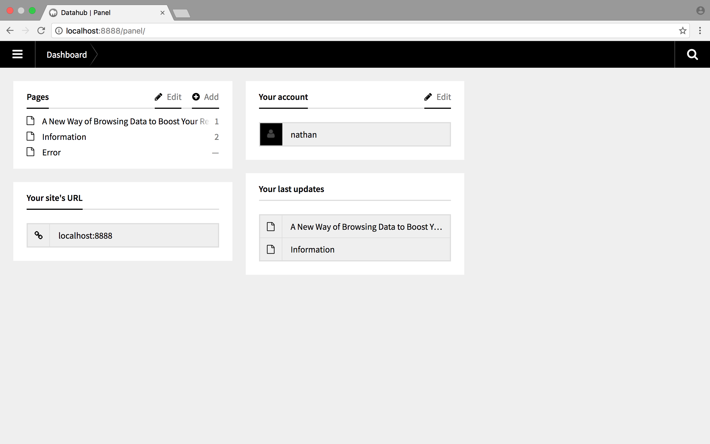

# AMS Datahub Content Management

1. [Getting Started](#getting-started)
2. [Content Management](#content-management)
3. [Content Fields](#content-fields)
4. [Content Structures](#content-structures)

## Getting Started
The AMS Datahub content website uses [Kirby CMS](https://getkirby.com/) to manage content and utilizes [Markdown](https://daringfireball.net/projects/markdown/) to format text. To gain access to the AMS Datahub content management panel you’ll need to get in touch with [contact]. 

Upon receiving your credentials you may [login to the panel](http://amsdatahub.waag.org/panel/login) using your email-address, and the password provided by [contact].
> Please change your password when you login for the first time, you can do this by clicking on your name below __Your Account__ in the [panel Dashboard](http://amsdatahub.waag.org/panel/).

*The Kirby CMS panel Dashboard.*

## Content Management
As if now there are three pages in the AMS Datahub website:

1. [Home](#home)
2. [Information](#information)
-  [Error](#error)

### Home
This is the home page when you visit [AMS Datahub](http://amsdatahub.waag.org), intended to reveal information about the datahub application. 

The editor can edit the following content:
- [Title](#title)
- [Text](#text)
- [Highlights](#highlights)

### Information
The information page is designed to communicate features of the AMS Datahub platform in more detail than the home page allows. The main content of this page is Feature blocks that use a title, image, and paragrapgh of text to explain a feature of the platform.

The editor can edit the following content:
- [Title](#title)
- [Features](#features)

### Error
The error page is designed to comminicate when some sort of error has been encountered, most commonly an error occurs because a page requested does not exist.

The editor can edit the following content:
- [Title](#title)
- [Text](#text)

## Content Fields
Content fields denote different types of content on a page, examples of different fields are a title, text, or image. Most fields will be required, indicated with an asterix (*) next to its label.

### Title
A title is required for every page, page titles are displayed on the browser tab, a google search result, and the main header on the page itself. Only a single rule of plain text is allowed.

A title may also occur within [Content Structures](#content-structures), if so the title is displayed as a part of its contents.

### Image
Image

### Text
Text

## Content Structures
Content structures are collections of different kinds of content within a page section.

### Highlights
Highlights

### Features
Features

