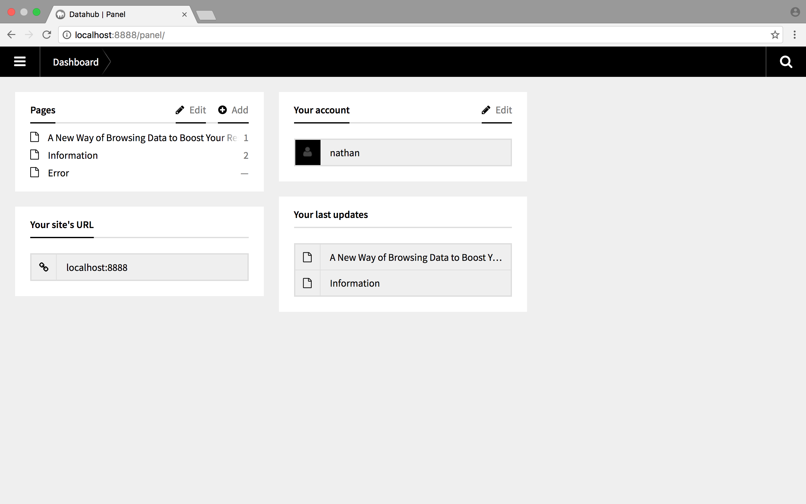
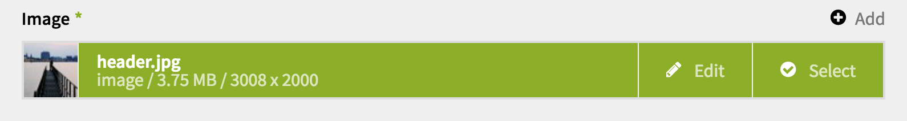
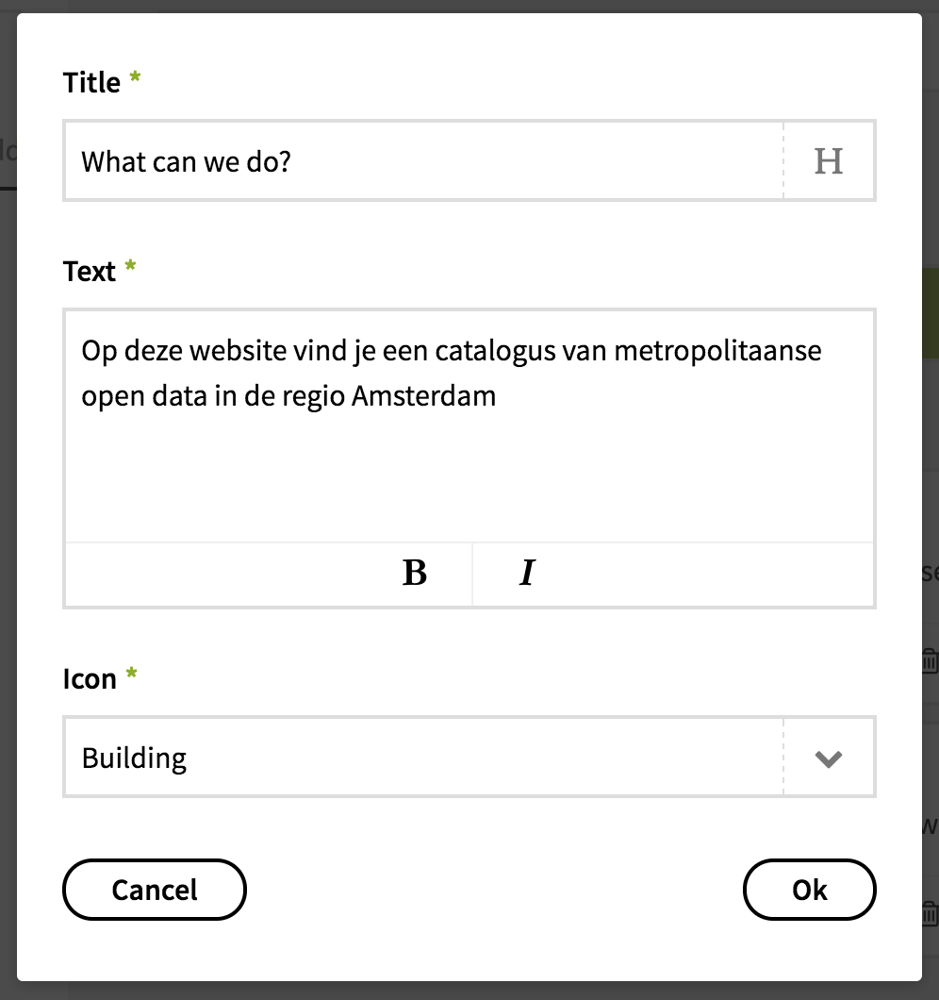
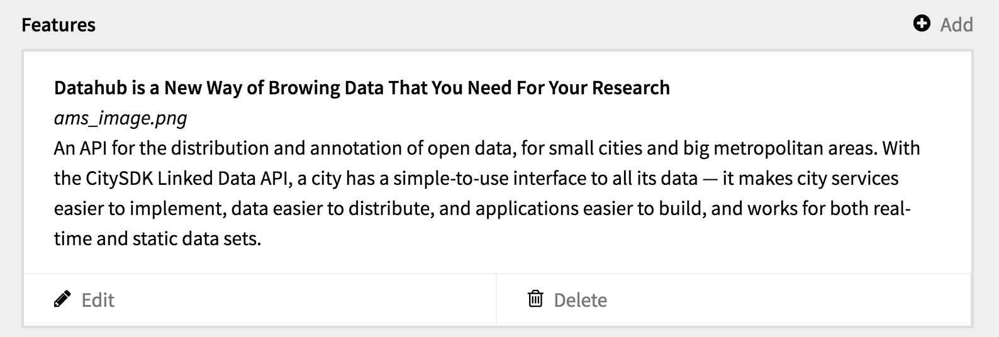

# AMS Datahub Content Management

1. [Getting Started](#getting-started)
2. [Page Management](#page-management)
3. [File Management](#file-management)
4. [Content Fields](#content-fields)
5. [Content Structures](#content-structures)

## Getting Started
The AMS Datahub content website uses [Kirby CMS](https://getkirby.com/) to manage content and utilizes [Markdown](https://daringfireball.net/projects/markdown/) to format text. To gain access to the AMS Datahub content management panel you’ll need to get in touch with [contact]. 

Upon receiving your credentials you may [login to the panel](http://amsdatahub.waag.org/panel/login) using your email-address, and the password provided by [contact].
> Caution: please change your password when you login for the first time, you can do this by clicking on your name below __Your Account__ in the [panel Dashboard](http://amsdatahub.waag.org/panel/).

*The Kirby CMS panel Dashboard.*

## Page Management
As if now there are three pages in the AMS Datahub website, pages can be found on the [panel Dashboard](http://amsdatahub.waag.org/panel/)

1. [Home](#home)
2. [Information](#information)
- [Error](#error)

### Home
This is the home page when you visit [AMS Datahub](http://amsdatahub.waag.org), intended to reveal basic information about the datahub application. 

The editor can update the following content:
- [Title](#title)
- [Highlights](#highlights)

### Information
The information page is designed to communicate features of the AMS Datahub platform in more detail than the home page allows. The main content of this page is Feature blocks that use a title, image, and paragrapgh of text to explain a feature of the platform.

The editor can update the following content:
- [Title](#title)
- [Features](#features)

### Error
The error page is designed to comminicate when some sort of error has been encountered, most commonly an error occurs because a page requested does not exist.

The editor can update the following content:
- [Title](#title)
- [Text](#text)

## File Management
Files are located in the left column of a page. To add an file to the page, click __Add__ next to the Files label. To manage files for a page, click __Edit__ next to the Files label.

Not all pages allow file uploads, in that case the Files section will be hidden.

## Content Fields
Content fields denote different types of content on a page, examples of different fields are a title, text, or image. Most fields will be required, indicated with an asterix (*) next to its label. 

> Note: a field may also occur within [Content Structures](#content-structures), if so its content is displayed within the structure.

### Title
A title is required for every page, page titles are displayed on the browser tab, a google search result, and the main header on the page itself. Only a single rule of plain text is allowed.

### Text
Text content allows text formatting using Markdown. With Markdown you can add text formatting such as italic or bold text, or add additional content like links or image files. Read a [markdown reference](http://commonmark.org/help/) for basic syntax or the full specification by [John Gruber](https://daringfireball.net/projects/markdown/).

### Image
Images are managed on the left column when editing a page. To add an image to a page, click __Add__ next to the [Files](#files) label. Upon uploading an Image press __Select__ on the Image field to activate the image for that field.

*A selected image.*

> Note: valid image extensions are jpeg, jpg, png, and gif. Jpeg or jpg are reccommended for photographic imagery. Please keep image dimensions below 1600px in either direction, and its file size below 200kb.

### Icon
Icons are part of the website design and can be selected from a drop-down menu. The available icons are:

*All icons side by side.*

- __Announcement__
  Suggests changes to the platform.
- __Attachment__
  Suggests a file system.
- __Building__
  Suggests an institution.
- __Construction__ 
  Suggests development or maintenance to the platform.
- __Database__
  Suggests data.
- __Layers__
  Suggests several depths of data.
- __Leaf__
  Suggests growth or sustainability.
- __Map__
  Suggests geographical data or information.
- __Pushpin__
  Suggests focus or longevity.
- __Rocket__
  Suggests advancement.
- __Search__
  Suggests search funcitonality.
- __Tag__
  Suggests tagging funcitonality.
- __User__
  Suggests user engagement.
- __User Group__
  Suggests collective engagement.

## Content Structures
Content structures are used to display *a list of structured content*. This means a structure can consist of multiple content fields, for example a [Title](#title) and an [Image](#image).

To add an item to a structured field, click the __Add__ button next to the field label. A popup appears where the content fields can be filled in.

> Note: due restrictions in Kirby CMS an [Image](#image) file must be uploaded *before* adding a structured item (if an image is required within its structure).

### Highlights
A highlight contains a [Title](#title), [Icon](#icon), and a short [Text](#text). Text length is not restricted but it’s recommended to contain this to a single line of text.
<!--  -->
<!-- *Popup to create or edit a Highlights item.* -->

### Features
A highlight contains a [Title](#title), [Image](#image), and a short [Text](#text). Text length is not restricted but it’s recommended to contain this to a single paragraph.
<!--  -->
<!-- *A preview of a Feature in the Kirby CMS page editor.* -->
